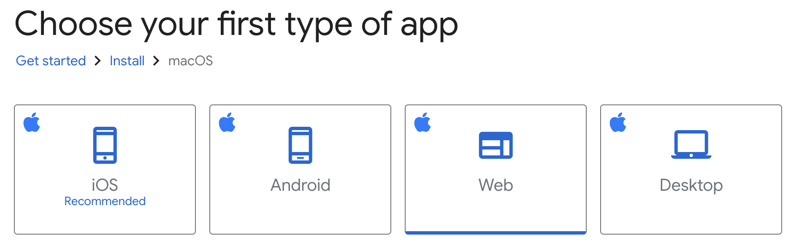

# CodeShare 💻📤

**CodeShare** is a tool that transforms your code into **beautiful, print-ready images**. It allows developers to easily customize, share, and showcase their code with style.


---

### 🚀 **Features:**

- **Customizable Themes**: Choose or create themes to make your code pop.
- **Real-Time Syntax Highlighting**: Instant highlighting for multiple programming languages.
- **High-Resolution Exports**: Save code snippets as **PNG, SVG**, or vector graphics.
- **Snippet Templates**: Predefined templates for common code structures.
- **Multi-Language Support**: Works with a wide range of programming languages.
- **Custom Fonts** - Choose from a range of fonts to give your snippets a personalized touch.

### 📝 **Challenges**

1. Add the feature described in [issue #1](https://github.com/Bevoyhealth/CodeShare/issues/1)
   - Start by creating a Specification document for feature #1. How should the tab key function? What are spcific scenarios and behaviors that should be supported? We want to match typical text editors behavior. Add it to the root of your fork as `specification.md`.
   - Implement your solution for the feature #1
   - Push the commits when done, so that we know when you finished the feature
2. Solve the bug described in the [issue #2](https://github.com/Bevoyhealth/CodeShare/issues/2)
   - Implement your solution for the bug #2
   - Push the commits when done, so that we know when you finished the bug
3. (Now the fun part) - export the image of any snippet of code or algorithm that you find really interesting. This could be from any language, could be from any source - could be from your own code, could be from someone else's code, could be from a book, could be from a blog post, etc. Add it to your submission along with a markdown file explaining why you find it interesting. Files should be named `interesting_code_snippet.png` and `interesting_explanation.md` and should be in the root of your fork.


### 📝 **Submission Instructions**

1. Fork this repository
2. Make your fork private
3. Add @parthjshah95 as a collaborator to your private fork
4. Implement your solution for the feature #1
5. Push the commits when done, so that we know when you finished the feature
6. If you still have time, solve the bug #2
7. Push your fix
8. Add a screenshot of your favourite code snippet and a markdown file explaining why you find it interesting
9. Push your changes
10. Notify us when complete

**Note:** Please ensure your fork is private to maintain the confidentiality of your solution.

### 💻 **Getting Started Locally**

To run **CodeShare** locally using Flutter Web, follow these steps:

1. **Clone the Repository**
   ```bash
   git clone https://github.com/Bevoyhealth/CodeShare.git
   cd CodeShare
   ```

2. **Install Flutter**

   Follow the instructions on the [Flutter official website](https://flutter.dev/docs/get-started/install).
   We recommend choosing web as the target platform. It's the fastest to setup and run.
   

3. **(Optional) Install VSCode**

   We recommend using VSCode with the [Flutter extension for VS Code](https://marketplace.visualstudio.com/items?itemName=Dart-Code.flutter) for this project. The extension provides dev tools for flutter, that is similar to the chrome dev tools for web. Chrome dev tools don't work with flutter web, since flutter does not user html/css/js, but instead uses webassembly/canvaskit. Hence, the vscode extension comes in handy to debug flutter web.

3. **Get Dependencies**
   ```bash
   flutter pub get
   ```

4. **Run the Project**

   Build and run the project for web (the `-d chrome` flag), as it is the fastest to setup and run.
   You may have to install chrome web driver on your machine for this to work.
   ```bash
   flutter run -d chrome
   ```
